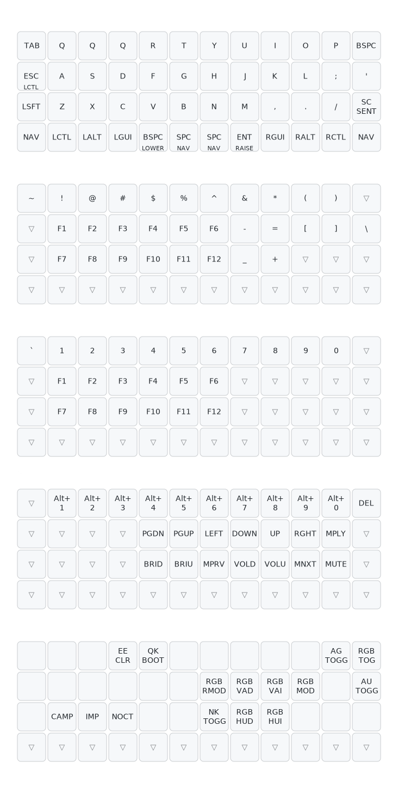

# Planck Keyboard Layout

## Layout

 

## Building

To build the keymap without installing tools globally, this repo uses a Makefile with the QMK version included as a submodule and the `qmk` CLI installed via [Poetry](https://python-poetry.org/) . It symlinks the keymap directory to the correct location in the QMK submodule directory.

Ensure Poetry is installed, run `poetry install` to install the `qmk` CLI. To build the firmware, simply run `make` build. To flash the firmware directly, set your Planck in reset mode and run `make flash`. If you need to clean the build artifacts, use `make clean`.

